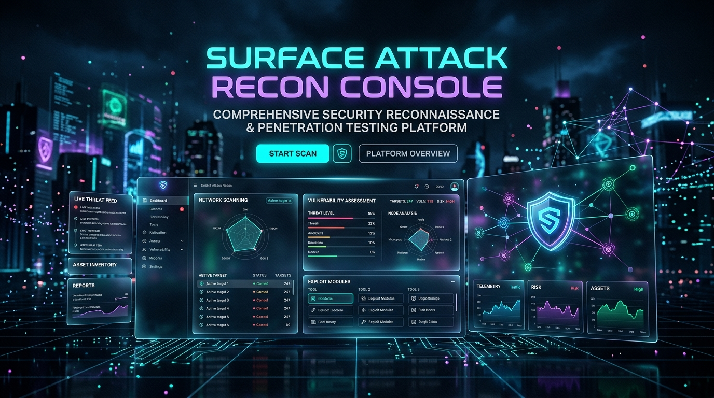
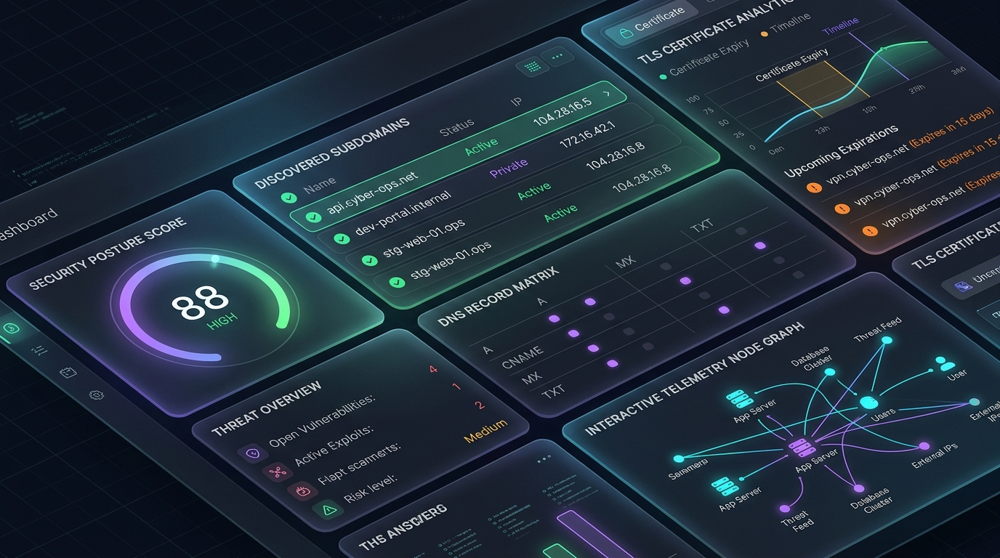

# Surface Attack Recon Console

<p align="center">
  
</p>

> **Liquid Glass & Cyber Reconnaissance Platform** — 100% genuine, real-data-only, non-destructive web reconnaissance for authorized security assessments.

<p align="center">
  
</p>

Mini Pentest Framework / Surface Attack Recon Console turns a single domain name into a focused reconnaissance report. It checks the target through actual DNS queries, HTTP/HTTPS requests, TLS connections, passive web-content analysis, and deterministic security rules.

No fake scan output. No mock dummy data. No port scanner. No Nmap.

## What It Does

Real-data reconnaissance across nine operational areas:

| Area | Observations |
| --- | --- |
| DNS | A, AAAA, CNAME, MX, NS, TXT records |
| HTTP/HTTPS | Status, redirects, headers, content type, server, response time |
| HTTPS Security | Availability, HTTP-to-HTTPS redirect, HSTS, mixed content, enforcement |
| TLS | Certificate, issuer, validity, SANs, cipher, hostname match, TLS version |
| Security Headers | Content-Security-Policy, HSTS, X-Frame-Options, and six more |
| Cookies | Name, Secure, HttpOnly, SameSite, Domain, Path, Expires, Max-Age |
| Discovery | Subdomains, API endpoints, JavaScript endpoints |
| Technologies | Fingerprinted technologies from HTTP headers and HTML |
| Findings | Deterministic security observations with real evidence |
| Security Posture | Real-time risk score calculated from actual observations |
| Reports | JSON and HTML reports from real scan results |

Every value comes from the target or from a genuine failed check. No dummy data. No fake results.

## Quick Start (Zero-Setup 1-Click Launchers)

Clone the repository:
```bash
git clone https://github.com/suryanagalingam877-code/surface-attack.git
cd surface-attack
```

### ⚡ Option A: 1-Click Automated Run (Recommended for Any User)

| Platform | 1-Click Command | What It Does Automatically |
| --- | --- | --- |
| **Windows (CMD)** | `run.bat` | Auto-creates `.venv`, installs requirements, sets up `.env`, and launches Web Console |
| **Windows (PowerShell)** | `.\run.ps1` | Auto-creates `.venv`, installs requirements, sets up `.env`, and launches Web Console |
| **Linux / macOS / Kali** | `./run.sh` | Auto-creates `.venv`, installs dependencies, sets up `.env`, and runs interactive scan |
| **Docker** | `docker compose up` | Runs complete platform in a container at `http://127.0.0.1:8000` |

---

### 🛠️ Option B: Manual Setup

**Step 1: Create the Python environment and install dependencies**

Windows (PowerShell):
```powershell
py -3.11 -m venv .venv
.\.venv\Scripts\Activate.ps1
python -m pip install -r backend\requirements.txt
Copy-Item backend\.env.example backend\.env
```

Windows (Command Prompt / CMD):
```cmd
py -3.11 -m venv .venv
.\.venv\Scripts\activate.bat
python -m pip install -r backend\requirements.txt
copy backend\.env.example backend\.env
```

Linux / macOS:
```bash
python3 -m venv .venv
source .venv/bin/activate
python -m pip install -r backend/requirements.txt
cp backend/.env.example backend/.env
```

**Step 2: Run the application**

```bash
python main.py
```

- On **Windows**, the browser opens automatically to the Liquid Glass dashboard.
- On **Linux**, the terminal asks for the target domain interactively.
- The pre-built production UI is bundled; no separate node/npm build is required for end users.

## Platform Modes

### Windows: browser mode

Windows opens a local dashboard automatically. The Python process serves both the backend and the built React frontend.

```powershell
cd D:\pentst
python main.py
```

The server binds to `127.0.0.1` and selects an available local port. The browser opens automatically.

### Linux, Kali, Ubuntu: terminal mode

Linux asks for the domain in the terminal and keeps the complete workflow in the terminal.

```bash
cd /path/to/pentst
python3 main.py
```

The terminal displays real module states, findings, errors, and report paths. It does not open a browser by default.

### Force a mode

```powershell
python main.py --cli
python main.py --web
```

```bash
python3 main.py --cli
python3 main.py --web
```

The domain is entered interactively. It is not required as a command-line argument.

## First-Time Setup

### 1. Create the Python environment

Windows PowerShell:

```powershell
cd D:\pentst
py -3.11 -m venv .venv
.\.venv\Scripts\Activate.ps1
python -m pip install -r backend\requirements.txt
Copy-Item backend\.env.example backend\.env
```

Linux:

```bash
cd /path/to/pentst
python3 -m venv .venv
source .venv/bin/activate
python -m pip install -r backend/requirements.txt
cp backend/.env.example backend/.env
```

### 2. Optional frontend development build

The tested production frontend is included, so this step is not required for normal use. Run it only after changing frontend source files:

```powershell
cd D:\pentst\frontend
npm install
npm run build
```

Then start the application from the repository root:

```powershell
cd D:\pentst
python main.py
```

Node.js is needed for frontend development and builds. It is not needed while the already-built dashboard is being served by Python.

## Development Workflow

Run the backend API directly when developing:

```powershell
cd D:\pentst
.\.venv\Scripts\Activate.ps1
python -m uvicorn app.main:app --app-dir backend --host 127.0.0.1 --port 8000
```

In a second terminal, run Vite with its `/api` proxy:

```powershell
cd D:\pentst\frontend
npm run dev
```

Open the Vite URL shown in the terminal, usually `http://127.0.0.1:5173`.

The Vite proxy forwards frontend requests to FastAPI at `http://127.0.0.1:8000`. If port 5173 is already occupied, Vite selects another port and displays it.

## Scan Lifecycle

The dashboard sends the entered domain to the backend:

```text
Domain input
    |
    v
POST /api/scan
    |
    v
Domain validation
    |
    v
Background scan engine
    |
    +-- DNS
    +-- HTTP/HTTPS
    +-- TLS
    +-- Subdomains
    +-- API discovery
    +-- Headers and cookies
    +-- Technology detection
    +-- robots.txt and sitemap
    |
    v
GET /api/scan/{scan_id}/status
    |
    v
GET /api/scan/{scan_id}/results
```

The accepted scan returns `STARTED`. The status endpoint reports the actual lifecycle state: `QUEUED`, `RUNNING`, `COMPLETED`, `PARTIAL`, or `FAILED`.

Reports are available at:

```text
GET /api/scan/{scan_id}/report/json
GET /api/scan/{scan_id}/report/html
```

FastAPI documentation is available at `/docs` when the API server is running.

## Configuration

Copy `backend/.env.example` to `backend/.env` and adjust only what your authorized test environment requires:

| Variable | Purpose |
| --- | --- |
| `DATABASE_URL` | SQLite or another SQLAlchemy database URL |
| `REQUEST_TIMEOUT` | Network timeout in seconds |
| `MAX_CONCURRENCY` | Upper bound for concurrent checks |
| `REQUEST_DELAY` | Optional request delay for conservative discovery |
| `USER_AGENT` | HTTP identification string |
| `MAX_REDIRECTS` | Redirect limit |
| `MAX_RESPONSE_SIZE` | Maximum response bytes retained |
| `SUBDOMAIN_WORDLIST` | Wordlist path |
| `REPORT_DIRECTORY` | Generated report directory |

The default server binding is local-only: `127.0.0.1`.

## Project Layout

```text
backend/
  main.py                 Cross-platform launcher
  app/
    api/                  Scan and report endpoints
    core/                 Configuration, logging, SQLite
    scanner/              Real reconnaissance modules
    findings/             Deterministic findings rules
    reports/              JSON and HTML report rendering
  tests/                  Unit tests
  wordlists/              Conservative subdomain candidates
frontend/
  src/                    React dashboard
  vite.config.js          Development API proxy
```

The scanner is independent from the terminal and web interfaces. Both modes use the same engine and the same result model.

## Safety Boundary

Use this framework only against domains you own or have explicit authorization to test.

The project intentionally does not implement:

- Nmap, port scanning, or service enumeration
- Exploitation or attack payloads
- Credential attacks or brute force
- JavaScript execution from target sites
- Shell execution from user input or downloaded content
- Public network binding by default

JavaScript resources are downloaded only when referenced by the target page and are treated as untrusted text for passive endpoint discovery.

### ⚡ Instant Scan & Resilient Target Input
- **Instant Scan on Enter**: Type any domain or website name and press `Enter` to run the scan immediately.
- **Auto-Normalizing Inputs**:
  - Plain website names (e.g. `google` or `railfeast` -> `google.com` / `railfeast.com`).
  - Full URLs with paths (e.g. `https://railfeast.com/about` -> `railfeast.com`).
  - URLs with ports or queries (e.g. `example.com:443?ref=test` -> `example.com`).
- **Quick Preset Chips**: 1-click test launches for `scanme.nmap.org` and `example.com`.

### 📂 Persistent Assessment History
- **SQLite Database Persistence**: Every scan is automatically recorded and preserved.
- **Inline History Feed**: Recent assessments appear right on the home landing page.
- **Slide-Out History Drawer**: Click `History (N)` from the top navigation bar anytime.
- **Instant Loading**: 1-click `View` button reloads any past assessment directly into the dashboard with zero re-scanning.
- **Standalone HTML Export & Deletion**: Quick links to download reports and delete individual records or clear history.

### 🎨 Luminous Aurora & Liquid Crystal Glass UI
- **Interactive Cyber Canvas**: Dynamic horizon perspective grid, floating luminous plasma clouds (cyan, indigo, magenta, emerald), and mouse-reactive constellation particle mesh.
- **Liquid Crystal Glass Cards**: `backdrop-filter: blur(28px) saturate(190%)` with white-glass specular highlights and fluid glowing borders.
- **Executive Posture Gauge**: Conic gradient score ring with risk level letter grade (`Grade A`, `Grade B`, `Grade C`, `Grade D`) and deterministic rule breakdown.

### 🛡️ Real HTTPS & Transport Security
- HTTPS availability and reachability.
- HTTP-to-HTTPS redirect enforcement detection.
- HSTS header parsing (`max-age`, `includeSubDomains`, `preload`).
- Mixed-content detection from actual HTML source.
- TLS version, cipher suite, issuer, and certificate validity dates.
- SAN matching and hostname verification.

### 🌐 Attack Surface Inventory & Recon Graph
- Discovered subdomains, API endpoints, JavaScript references.
- Interactive graph nodes linked with authentic discovery evidence.
- Zero mock or placeholder connections.

### 📄 Executive Reporting
- Standalone self-contained Dark Glass HTML report.
- Machine-readable JSON report.

## Verification

Run the test suite:

```powershell
cd D:\pentst\backend
.\.venv\Scripts\python.exe -m pytest -q tests
```

Compile check:

```powershell
cd D:\pentst\backend
.\.venv\Scripts\python.exe -m compileall -q app main.py
```

Build the frontend (optional, only needed when editing frontend source code):

```powershell
cd D:\pentst\frontend
npm run build
```

All backend tests pass (`13 passed in 1.41s`).

## Troubleshooting

**`No module named app`**

Run the command from `backend`, or use the root launchers (`run.bat`, `.\run.ps1`, `./run.sh`, `python main.py`). The application automatically configures Python import paths.

**`Dependencies are missing`**

Run:
```powershell
python -m pip install -r backend\requirements.txt
```
Or run `run.bat` / `.\run.ps1` / `./run.sh` to automatically set up the virtual environment and install dependencies.

**Port 5173 is already in use**

Vite automatically selects another local port. Use the URL printed by Vite.

**A scan is `PARTIAL`**

Open the Errors section or inspect the report. A partial scan means one or more real modules failed; failed checks are preserved rather than presented as successful results. Check the timeline and error logs to identify which module failed.

## License

See [LICENSE](LICENSE).

